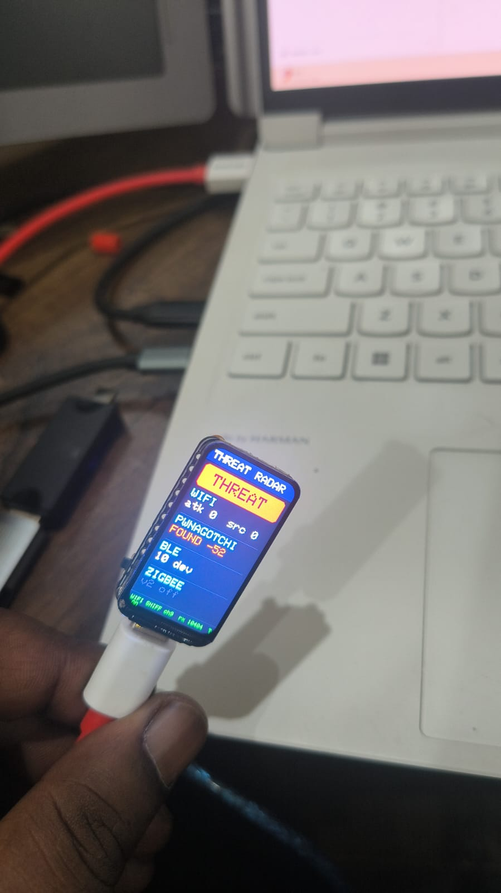
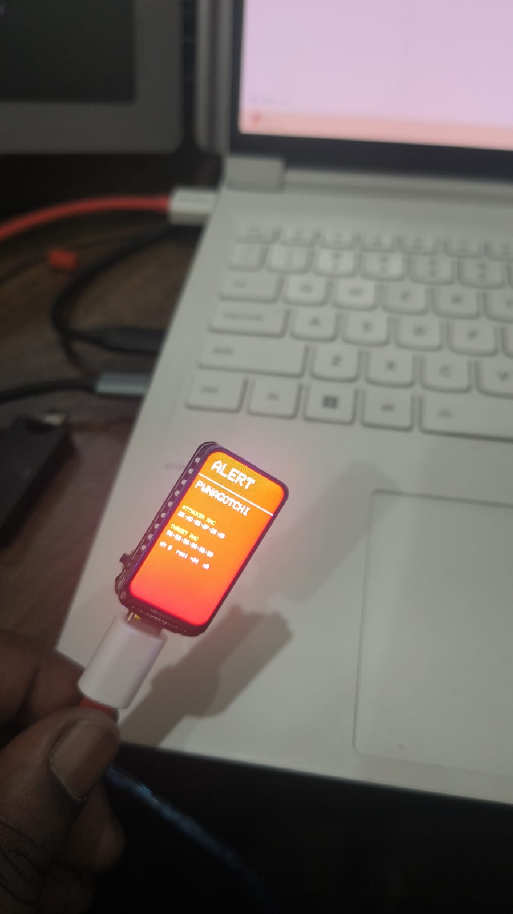

# 🛡️ Wireless Threat Radar — ESP32-C6

A pocket **defensive wireless monitor** for the **ESP32-C6 + 1.47″ LCD**. It passively watches the **2.4 GHz** air around you and flags nearby wireless attacks on its screen in real time — **detection only, it never attacks.**

| Live radar | Threat detected — ALERT |
|:---:|:---:|
|  |  |

*Waveshare ESP32-C6-LCD-1.47 prototype — live radar status (left) and a full-screen ALERT with attacker + target MAC (right).*

> 📡 **Heads-up — 2.4 GHz band only.** The ESP32-C6 has **no 5 GHz radio**, so this radar does not see 5 GHz networks/attacks. That's fine for most threats (pwnagotchi is 2.4 GHz-only; most deauth targets 2.4 GHz) — but if you need 5 GHz, run this on a dual-band **ESP32-C5** instead. See [Hardware](#hardware).

> Built to learn how the attacks work by building the thing that catches them. Offense → defense.

    

---

## What it detects

| Threat | How | Screen |
|---|---|---|
| **WiFi deauth / disassoc attack** | 802.11 promiscuous sniff; `>10` deauth/disassoc frames per second from one source | 🔴 `WIFI DEAUTH` + attacker & target MAC, channel, RSSI |
| **Pwnagotchi nearby** | Beacon with source MAC `de:ad:be:ef:de:ad` (the pwngrid signature) | ⚠️ `PWNAGOTCHI FOUND` + RSSI |
| **BLE advertisement flood / spam** | Passive BLE scan; advertisement-rate spike + known spam company-IDs (Apple/MS/Google) | 🔴 `BLE SPAM` |
| **Zigbee / 802.15.4** | _deferred to v2_ — needs WiFi off (radio coexistence), so it's a separate future mode | `v2 off` |

The LCD shows a big **🟢 SECURE / 🔴 THREAT** status at a glance, per-protocol tiles, and a live `rx` frame counter so you can see the sniffer is alive.

---

## Hardware

**Waveshare ESP32-C6-LCD-1.47** — ESP32-C6 (RISC-V, **WiFi 6 @ 2.4 GHz** + BLE 5 + 802.15.4), 1.47″ **ST7789** 172×320 IPS LCD, 8 MB flash. No external parts needed — **LCD only.**

> ⚠️ **2.4 GHz only.** The ESP32-C6 has no 5 GHz radio, so this radar monitors the 2.4 GHz band only. In practice this covers almost everything — pwnagotchi is 2.4 GHz-only by design, and most deauth attacks target 2.4 GHz clients. For 5 GHz coverage you'd need a dual-band chip such as the **ESP32-C5** (which has no onboard LCD).

| LCD signal | GPIO |
|---|---|
| SCK | 7 |
| MOSI | 6 |
| DC | 15 |
| CS | 14 |
| RST | 21 |
| Backlight | 22 |

---

## Build & flash

**Toolchain:** [arduino-cli](https://arduino.github.io/arduino-cli/) (or Arduino IDE) with the **esp32 core ≥ 3.x** and the **GFX Library for Arduino**.

```bash
arduino-cli core install esp32:esp32
arduino-cli lib install "GFX Library for Arduino"

arduino-cli compile --fqbn esp32:esp32:esp32c6:PartitionScheme=huge_app --output-dir build .
```

> The `huge_app` partition scheme is required — Bluedroid BLE + WiFi + the graphics library together overflow the default partition.

**Flash** the merged image at `0x0`.

**Windows** (replace `COM5` with your port):
```bat
python -m esptool --chip esp32c6 -p COM5 -b 460800 write_flash 0x0 build/deauth_detector.ino.merged.bin
```

**Linux / macOS** (port is usually `/dev/ttyACM0` for the native USB-JTAG, or `/dev/ttyUSB0`):
```bash
esptool --chip esp32c6 -p /dev/ttyACM0 -b 460800 write_flash 0x0 build/deauth_detector.ino.merged.bin
# (if 'esptool' isn't found: python3 -m esptool ... ; install with: pip install esptool)
```

If `esptool` can't connect, hold the **BOOT** button while it says *Connecting…*. Then open a serial monitor at **115200** (`screen /dev/ttyACM0 115200` / Arduino IDE) to see `[boot]` breadcrumbs and a live `rx`/alert log.

---

## How it works (and its honest limits)

The ESP32-C6 has **one** 2.4 GHz radio shared by WiFi, BLE, and 802.15.4. Everything is **time-sliced**:

- **Phase A (~16 s):** WiFi promiscuous mode, channel-hopping 1→13. A minimal `IRAM_ATTR` sniffer callback pushes deauth events into a lock-free ring buffer; aggregation + thresholds run in the main loop.
- **Phase B (~2 s):** a bounded passive BLE scan (bundled Bluedroid), results cleared every cycle to avoid heap leaks.

Because it's one radio, sampling is **probabilistic** — it can miss frames on a channel it isn't currently parked on, and BLE PDUs during the WiFi phase. **Run an attack continuously for ~10-20 s** to be sure it lands in a sweep. This is physics, not a bug; only a second dedicated radio gives lossless concurrent capture.

### Optional presence beacon
The firmware can broadcast a low-rate open beacon (a chosen SSID) while sniffing. Edit the `beacon[]` SSID bytes to change it, or remove the `esp_wifi_80211_tx(...)` call to disable. Beacon broadcasting can trip a corporate WIDS — keep it to your own bench.

---

## ⚖️ Legal & ethical use

This is a **passive, detection-only** tool for **education and defensive security**. It does **not** perform deauth, jamming, or any attack. Use it only on **networks and devices you own or are explicitly authorized to monitor**. You are responsible for complying with the laws in your jurisdiction. The authors assume no liability for misuse.

A pwnagotchi MAC is spoofable — detection is a hint, not proof.

---

## Authors

Built by **Chetan Saini** ([@cyberac1d](https://instagram.com/cyberac1d)) with **Ella**, his AI pair-partner. 🤝

Detection signatures & techniques reference the excellent [ESP32 Marauder](https://github.com/justcallmekoko/ESP32Marauder) project and the pwnagotchi/pwngrid community.

## License

[MIT](LICENSE) © Chetan Saini
